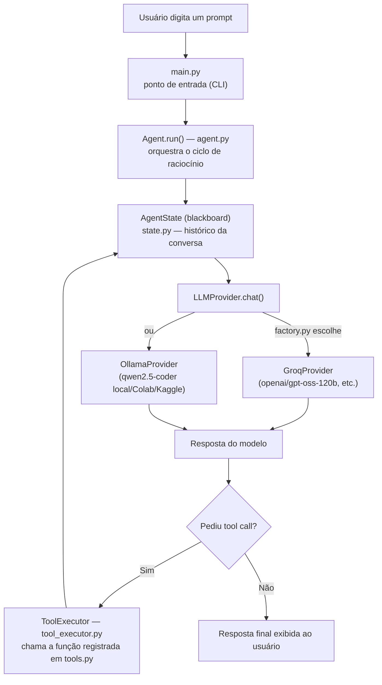

# my_agent_code 

Um agente de codificação autônomo construído do zero — sem depender de GPU própria, sem assinatura de Claude Code/Codex, e sem a fricção de configurar ferramentas open source prontas como o OpenCode.

## Por que esse projeto existe

A ideia começou de um problema bem prático: eu queria um agente de IA pra me ajudar em atividades da faculdade e em projetos pessoais, mas:

- **Meu computador não tem GPU pra rodar modelos localmente** com qualidade aceitável, testei modelos quantizados e tive travamentos e resultados ruins rodando em CPU e em GPU integrada.
- **Claude Code e Codex resolvem, mas custam dinheiro**, e como estudante sem renda, isso não era opção.
- **Testei o OpenCode**, mas esbarrei em dificuldade pra customizar/trocar de modelo e na dependência de hardware que eu não tenho.

Em vez de desistir ou pagar, decidi resolver o problema de inferência gratuita por conta própria e, no processo, **construir meu próprio agente de codificação do zero**  entendendo cada peça em vez de só consumir uma ferramenta pronta. A busca por inferência grátis passou por algumas rotas até chegar no formato atual:

1. **Oracle Cloud Always Free** (VM ARM gratuita pra sempre) — ideia original, mas a fila de capacidade disponível é grande e difícil de automatizar.
2. **Google Colab** — GPU T4 gratuita, só que a sessão morre quando o notebook fecha e a URL do túnel muda toda vez.
3. **Groq** — inferência de modelos open source (Llama, GPT-OSS, etc.) via API, gratuita e sem cartão de crédito, com rate limit generoso pra uso individual. É o motor padrão do projeto hoje.
4. **Kaggle Notebooks** — alternativa ao Colab quando quero rodar um modelo específico via Ollama (30h/semana de GPU grátis, sessões mais longas).

O resultado é um agente que roda **inteiramente de graça**, sem depender de uma só fonte de inferência.

## Arquitetura

O agente segue o loop de um coding agent que aprendi vendo uns videos da Anthropic, o modelo recebe o histórico da conversa + a lista de ferramentas disponíveis, decide se quer chamar uma ferramenta ou responder, o agente executa a ferramenta e devolve o resultado pro modelo, repetindo até ele decidir que a tarefa terminou.



**Peças principais:**
 
- **`main.py`** — ponto de entrada enxuto: lê o prompt (argumento de linha de comando ou input interativo) e delega tudo pro `Agent`.
- **`agent.py`** — a classe `Agent` concentra o ciclo de raciocínio: manda o histórico pro provider, interpreta a resposta (tool call nativa ou JSON solto no texto, pra modelos menores que não seguem o formato à risca) e despacha as ferramentas pedidas via `ToolExecutor`.
- **`tool_executor.py`** — recebe uma tool call já normalizada, valida se a ferramenta existe no registro e executa, devolvendo o resultado no formato que o histórico espera.
- **`llm/`** — abstração de provider (padrão Strategy). `base.py` define a interface comum e normaliza tool calls entre diferentes formatos de API (dict ou objeto SDK da OpenAI); `groq.py` e `ollama.py` implementam cada backend; `factory.py` escolhe qual usar via variável de ambiente, sem precisar mexer no resto do código pra trocar de modelo.
- **`tools.py`** — as ferramentas que o agente pode executar. Cada uma é registrada com o decorador `@register_tool`, que gera automaticamente o schema JSON exigido pela API a partir da assinatura da função (via Pydantic) — não precisa escrever o schema na mão.
- **`state.py`** — o "blackboard": guarda o histórico de mensagens (`add_system`, `add_user`, `add_assistant`, `add_tool_result`) que é reenviado a cada chamada, já que os providers não têm memória própria entre requisições.


## Ferramentas disponíveis hoje

| Ferramenta | O que faz |
|---|---|
| `execute_bash` | Executa comandos de terminal dentro de `/workspace`, com timeout de 30s |
| `read_file` | Lê o conteúdo de um arquivo |
| `write_file` | Cria/sobrescreve um arquivo |

`read_file` e `write_file` são restritas a `/workspace` — qualquer tentativa de acessar caminhos fora dali (`../../etc/...`) é bloqueada antes de tocar no disco.

## Como rodar

### 1. Escolha seu provider de inferência

**Opção A — Groq (recomendado, mais simples)**
Crie uma conta gratuita em [console.groq.com](https://console.groq.com) e gere uma API key.

**Opção B — Ollama via Colab/Kaggle (modelo próprio)**
Abra [`teste_agente.ipynb`](teste_agente.ipynb) no Google Colab ou Kaggle, rode todas as células e copie a URL pública gerada pelo túnel Cloudflare.

### 2. Configure as variáveis de ambiente

Edite o [`docker-compose.yml`](docker-compose.yml) (ou, melhor ainda, use um `.env` pra não versionar suas chaves):

```yaml
environment:
  LLM_PROVIDER: groq              # ou "ollama"
  GROQ_API_KEY: sua_chave_aqui
  GROQ_MODEL: openai/gpt-oss-120b
  OLLAMA_HOST: https://sua-url-cloudflare-aqui  # se usar Ollama
  OLLAMA_MODEL: qwen2.5-coder:7b-instruct-q4_K_M
```

### 3. Suba e rode o agente

```bash
docker compose up -d
docker compose run --rm agent
```

Ou passe o prompt direto:

```bash
docker compose run --rm agent "crie uma pasta chamada coisas_legais_para_nerds_felizes"
```

> [!NOTE]
> Se estiver usando Ollama via Colab, o modelo só fica disponível enquanto o notebook estiver rodando — a URL muda a cada nova sessão.

## Limitações conhecidas

Seguindo a filosofia de "primeiro fazer funcionar, depois melhorar", algumas coisas ainda faltam de propósito:

- **Sem limite de iterações** no loop principal — um modelo confuso pode ficar chamando ferramentas indefinidamente.
- **Sem memória persistente** entre execuções — cada `docker compose run` começa do zero.
- **Sem allowlist de comandos** no `execute_bash` — hoje o risco é baixo por rodar em container isolado e uso individual, mas não é adequado pra expor a outros usuários.

## Próximos passos que senti necessidade nos testes

- Ferramentas de navegação de código (`list_dir`, `grep_search`), limitando a leitura para bloquear `.env`
- `apply_patch` (diffs) em vez de reescrever arquivos inteiros
- Adicionar ferramentas de git para uso
- Resumo automático de histórico pra não estourar a janela de contexto de modelos menores
- Fallback automático entre providers quando um rate-limitar
- Sistema de memória persistente para recuperar histórico de que fez momentos antes ou dias atrás, preferências e tals
- UI amigável (rich), terminal assim rodando comando docker toda vez que executar é feio e chato
- Disponibilizar ferramentas de pesquisa na web para quando o agente precisar pesquisar
- Isolamento docker para o agente poder compilar ou instalar em container separado do seu
- Human in the loop para comandos perigosos
- Multi-Agentes? Manager & Workers? seria bom olhar o estado da arte até este ponto? (sinceramente não to interessado nisto no momento, não é prioridade)
- Limite de iterações no loop
- Loop de autoverificação (para rodar testes depois de editar e verificar se funciona de verdade)
- checkpoint e roolback via git